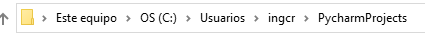
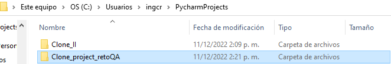
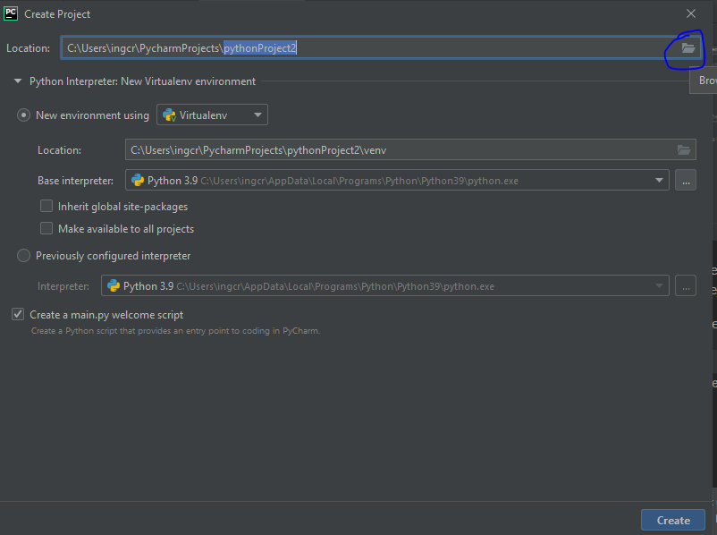
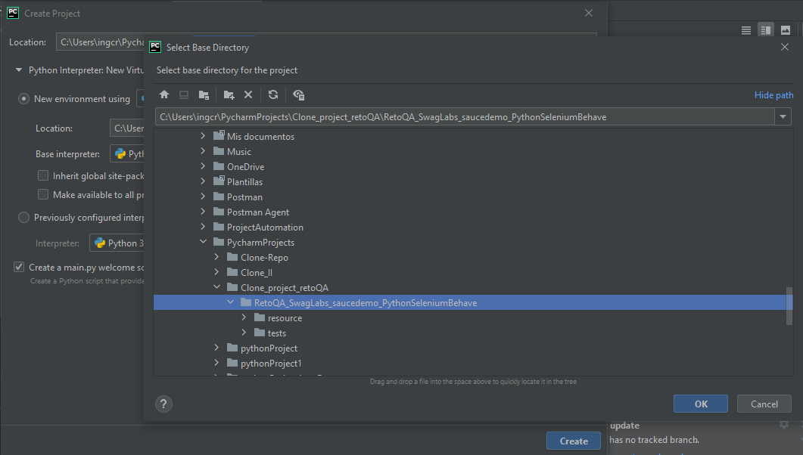
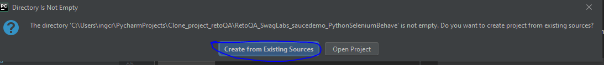
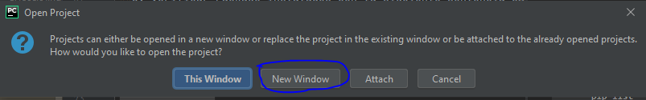
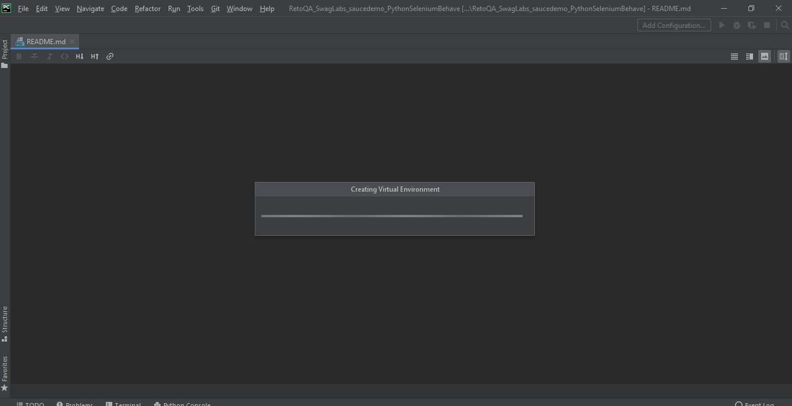
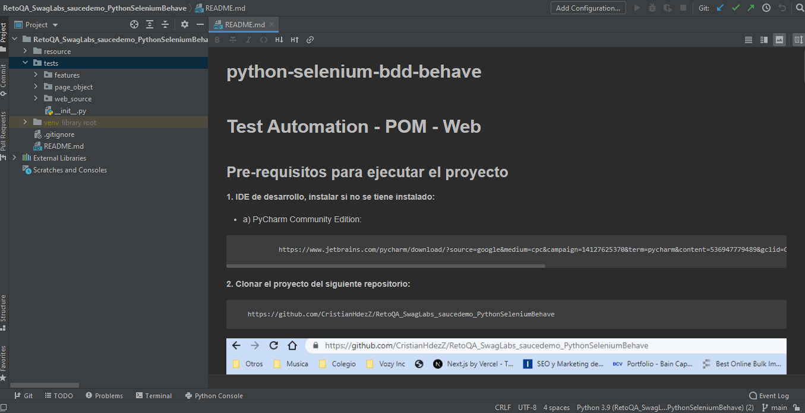
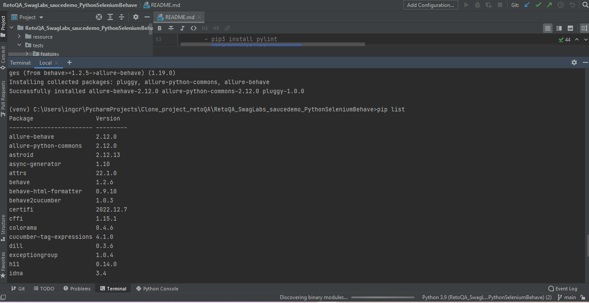
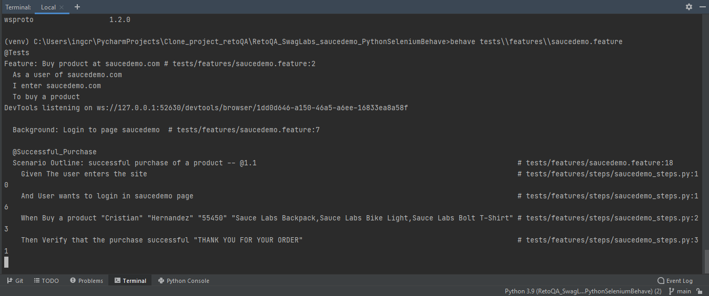

# python-selenium-bdd-behave
#**Test Automation - POM - Web**

## Pre-requisitos para ejecutar el proyecto

**1. IDE de desarrollo, instalar si no se tiene instalado:** 
	
- a) PyCharm Community Edition: 

      
               https://www.jetbrains.com/pycharm/download/?source=google&medium=cpc&campaign=14127625370&term=pycharm&content=536947779489&gclid=CjwKCAiA-dCcBhBQEiwAeWidtctc3paoK44Mag5nDRAY3GyyFLpZQyk861Phv1gXYyam8LaIRUwZBhoC3WAQAvD_BwE#section=windows
   

**2. Clonar el proyecto del siguiente repositorio:** 
  
       https://github.com/CristianHdezZ/RetoQA_SwagLabs_saucedemo_PythonSeleniumBehave
   
   
   - Crear una nueva carpeta en la dirección que crea PyCharm por defecto para sus proyectos. En mi caso es la siguiente la ruta cambiara, dependiendo el nombre de user que se tenga en la pc:
            
    - C:\Users\ingcr\PycharmProjects

 - Nombre de la nueva carpeta: 
        
        - Clone_project_retoQA

    

- Entrar a la nueva carpeta (Clone_project_retoQA) 

        - C:\Users\ingcr\PycharmProjects\Clone_project_retoQA

   - Abril la terminal git desde el directorio de la nueva carpeta(Clone_project_retoQA):
    

   

   - En la terminal de git, pegar la siguiente sentencia:
   
         git clone https://github.com/CristianHdezZ/RetoQA_SwagLabs_saucedemo_PythonSeleniumBehave.git

   

   
   
   - Abril PyCharm y crear un nuevo proyecto

   
   
   
  - Seleccionar el proyecto que se clono ubicado en la carpeta nueva creada(Clone_project_retoQA)
    
    
  
  - Dar click en ok, crear y en la opción "Create from Existing Sources" 
  

  - Y dar click en New Windows
    
    
   - Y esperamos que se configure el proyecto  
   
     
   - El proyecto debe quedar de las siguiente forma:

**3. Verificar Package instalados con la siguiente sentencia en la terminal:**
 
         pip list
   
   
   

**4. Se instalan los siguiente package desde la terminal:**
   
       - pip install selenium
       - pip3 install behave
       - pip3 install behave2cucumber
       - pip3 install cucumber-tag-expressions
       - pip3 install behave-html-formatter
       - pip3 install behave-jenkins
       - pip3 install pylint
       - pip3 install allure-behave  
          
      
   

         

**5. Y finalmente ejecutamos desde la terminal con la siguiente sentencia:**

    behave tests\features\saucedemo.feature

**6. Features**
   1. Comprar uno o varios articulos
   2. Hacer logout
   3. Login fallido   
   

---
## ️Autores
* **Cristian Hernandez Z.**  - [CristianHdezZ](https://github.com/CristianHdezZ/)
---