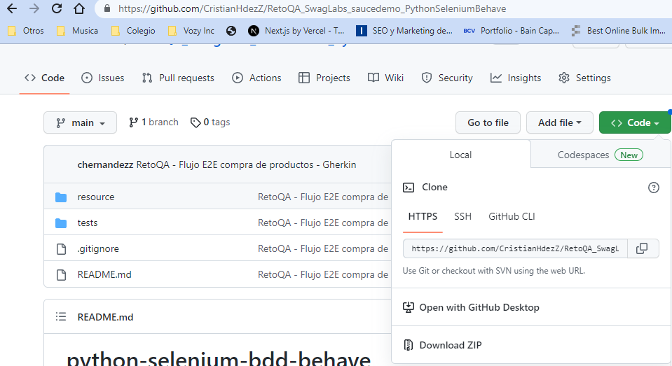
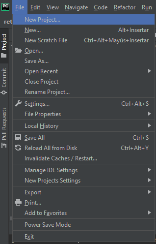

# python-selenium-bdd-behave
#**Test Automation - POM - Web**

## Pre-requisitos para ejecutar el proyecto

**1. IDE de desarrollo, instalar si no se tiene instalado:** 
	
- a) PyCharm Community Edition: 

      
               https://www.jetbrains.com/pycharm/download/?source=google&medium=cpc&campaign=14127625370&term=pycharm&content=536947779489&gclid=CjwKCAiA-dCcBhBQEiwAeWidtctc3paoK44Mag5nDRAY3GyyFLpZQyk861Phv1gXYyam8LaIRUwZBhoC3WAQAvD_BwE#section=windows
   

**2. Clonar el proyecto del siguiente repositorio:** 
  
       https://github.com/CristianHdezZ/RetoQA_SwagLabs_saucedemo_PythonSeleniumBehave
   
   

   - Abril la terminal git en un directorio de su preferencia:

   

   - En la terminal de git, pegar la siguiente sentencia:
   
         git clone https://github.com/CristianHdezZ/RetoQA_SwagLabs_saucedemo_PythonSeleniumBehave.git
   
   
   
   - Abril PyCharm y abril el proyecto

   
   

   - Y esperamos que se configure el proyecto  
   
**3. Verificar Package instalados con la siguiente sentencia en la terminal:**
 
         pip list
   
   
   

**4. Si no están en la lista anterios se instalan los siguiente package desde la terminal:**
   
       - pip install selenium
       - pip3 install behave
       - pip3 install behave2cucumber
       - pip3 install cucumber-tag-expressions
       - pip3 install behave-html-formatter
       - pip3 install behave-jenkins
       - pip3 install pylint
       - pip3 install allure-behave  
          
      
    

         

**5. Y finalmente ejecutamos desde la terminal con la siguiente sentencia:**

         behave tests\features\saucedemo.feature

**6. Features**
   1. Comprar uno o varios articulos
   2. Hacer logout
   3. Login fallido   
   

---
## ️Autores
* **Cristian Hernandez Z.**  - [CristianHdezZ](https://github.com/CristianHdezZ/)
---